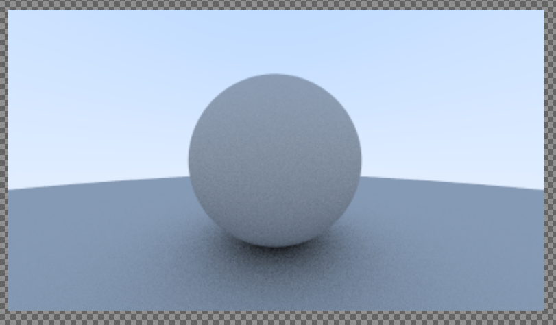
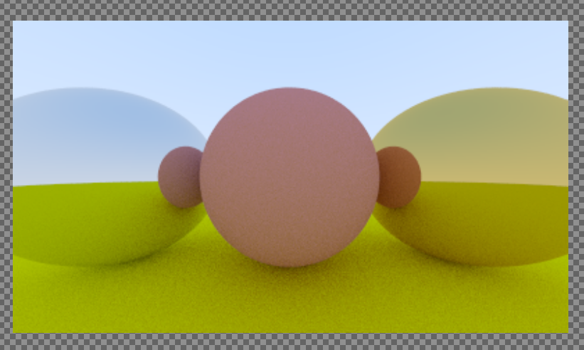
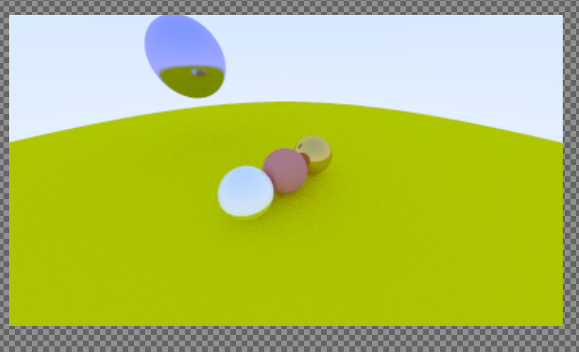
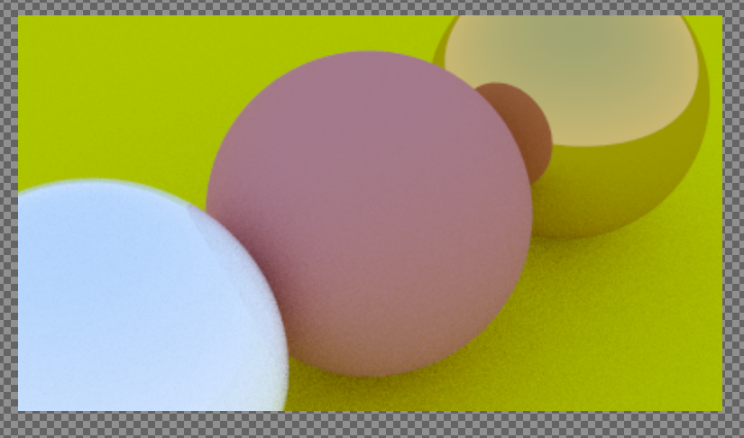
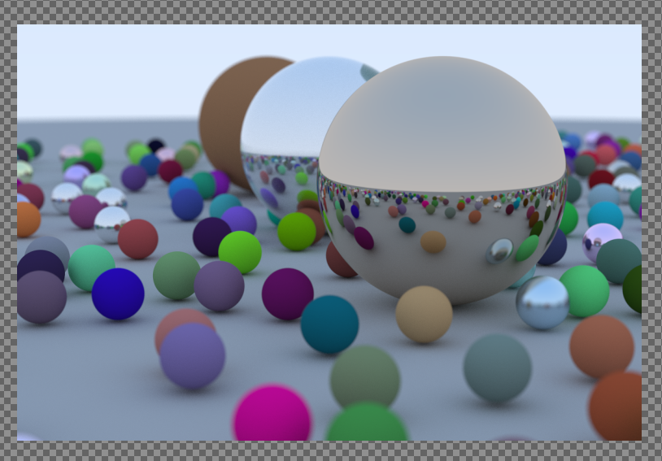

# rust-raytracing
Ray Tracing In One Weekend, but written in rust.

I also had to really think **A LOT** about how to translate the OOP-y code into more functional/value-oriented rust code.
E.g. instead of using dynamic dispatch, I dispatch on enums using the enum_dispatch crate.
Also, I don't use so called "in parameters", and instead *return* all data, instead of setting pointers. 

One problem in my code: I wasn't able to make Dielectric materials work correctly, and I have no idea why.

link to guide I followed: https://raytracing.github.io/books/RayTracingInOneWeekend.html

## images generated from my code:

_So cool (took 4.5 hours on my slow computer):_

